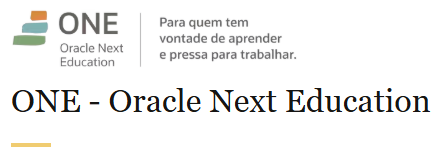

[](https://github.com/danilodevsys)

---

# 📊 Análise de Desempenho de Lojas — *Challenge Data Science*

Este projeto tem como objetivo analisar dados de vendas de **quatro lojas fictícias da rede Alura Store**, fornecendo uma recomendação fundamentada sobre **qual unidade apresenta o menor desempenho** e, portanto, **deveria ser considerada para venda**.

---

## 🎯 Objetivo

Auxiliar o **Senhor João**, proprietário da rede, na **tomada de decisão estratégica baseada em dados**.  
A análise integra informações de:

- 💰 **Faturamento**
- ⭐ **Satisfação do cliente**
- 🚚 **Custos operacionais (frete)**

Com base nesses indicadores, o projeto identifica **a loja com os maiores desafios e menor potencial de crescimento**.

---

## 🧩 Estrutura do Projeto

O código foi organizado em **módulos independentes** para garantir clareza, escalabilidade e manutenção simples:

| Arquivo | Função |
|----------|--------|
| `importacao.py` | Centraliza o carregamento e a unificação dos dados de todas as lojas a partir de fontes online. |
| `analise_*.py` | Scripts individuais para análises específicas — faturamento, frete, avaliações, etc. Cada módulo gera um relatório e um gráfico. |
| `desafio_concluido.py` | **Script principal** que orquestra toda a análise, gera o relatório consolidado no terminal e exibe o dashboard final. |

---

## 🛠️ Como Executar o Projeto

Siga os passos abaixo para executar a análise em seu ambiente local.

### 1. Pré-requisitos

-   Python 3.6 ou superior.

### 2. Instalação

Primeiro, clone este repositório para a sua máquina:
```bash
git clone <url-do-seu-repositorio>
cd <nome-do-repositorio>
```

Em seguida, instale as dependências necessárias utilizando o arquivo `requirements.txt`:
```bash
pip install -r requirements.txt
```

### 3. Executando a Análise Principal

Para rodar o projeto completo e obter o relatório final, execute o script `desafio_concluido.py`:

```bash
python desafio_concluido.py
```

### 4. O que Esperar

Ao executar o comando acima, duas coisas acontecerão:

1.  **No seu terminal:** Será impresso um relatório de texto detalhado, explicando o objetivo da análise, a justificativa e a conclusão sobre qual loja vender.

    ```
    ======================================================================
            RELATÓRIO DE ANÁLISE DE DESEMPENHO DAS LOJAS
    ======================================================================
    ...
    ```

2.  **Uma nova janela:** Um gráfico (dashboard) será exibido, contendo um gráfico de pizza que aponta visualmente para a loja recomendada para venda, junto com uma legenda detalhada que apresenta os principais indicadores (Faturamento, Avaliação Média e Frete Médio) de cada loja.

## ✒️ Autor

- **Danilo C Silva** - danilodevsys
